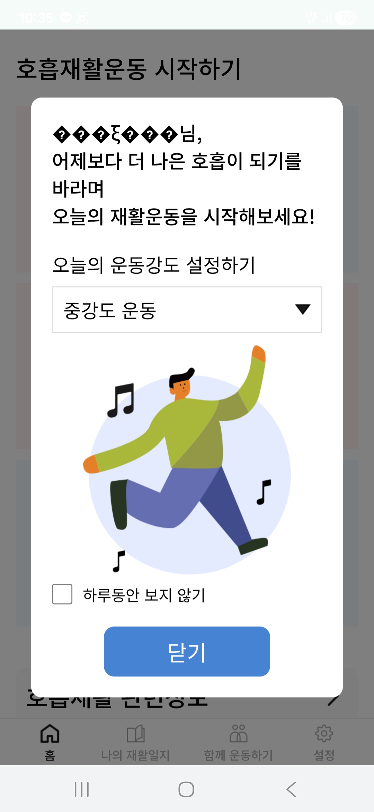
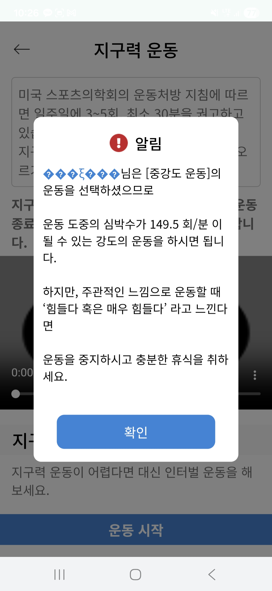
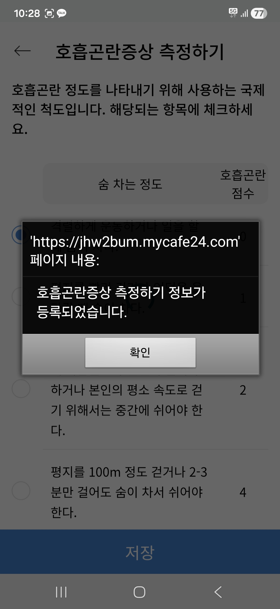
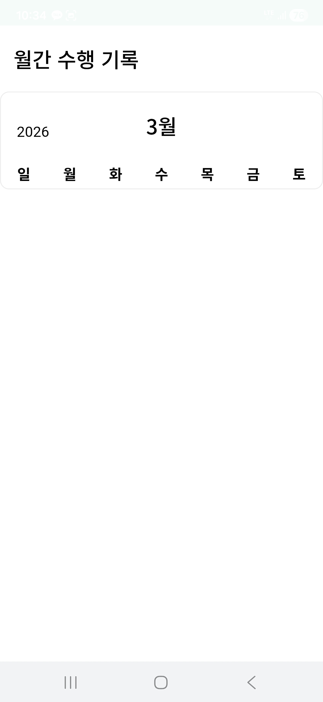
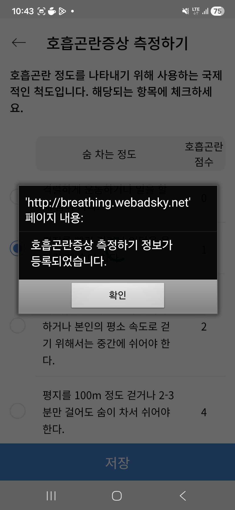
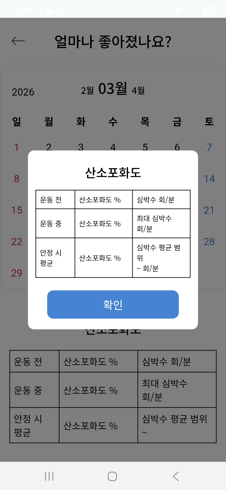
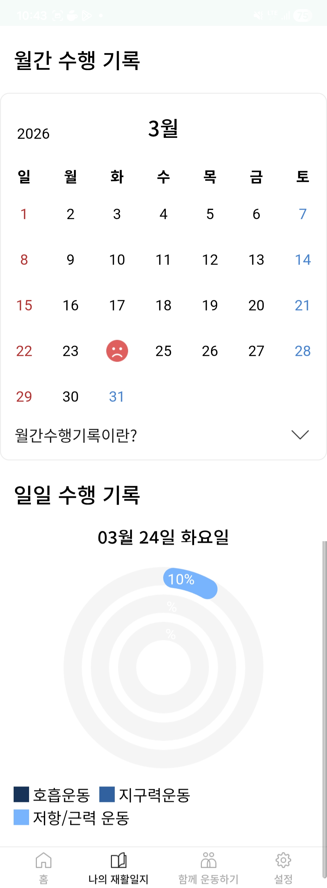

제가 앱을 설치해서 ID, PW입력하고 로그인하면 
1)이름이 아랍어처럼 깨져있고, (닉네임수정해도 반영이 안됨), 
2)호흡곤란증상확인하기에서 뒤로안가지고 핸드폰 뒤로가기버튼도 안먹히고(왼쪽화면에 false가 뜨면서), 
3) '얼마나 좋아졌나요' 에서 '안전한 운동을 했나요'의 날짜의 기록이 안넘어옴, 
4) 월간수행기록에서도 그래프가 안보이네요. 
그런데 네이버로 로그인해서 보면 1)잘되고 2)은 안되고 3)은 안되고 4)는 잘보이네요.. 이럴수도 있나요? ㅎㅎ

+그리고 서비스이용약관 항목의 텍스트에서 웹사이트주소를 바뀐 주소로 수정도 부탁드립니다:)

이건 네이버로 로그인했을때 화면이예요!
(여긴 아직 webadsky주소가 나오네요)

