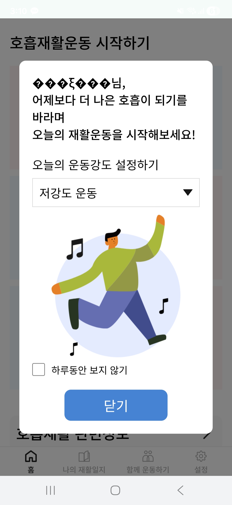
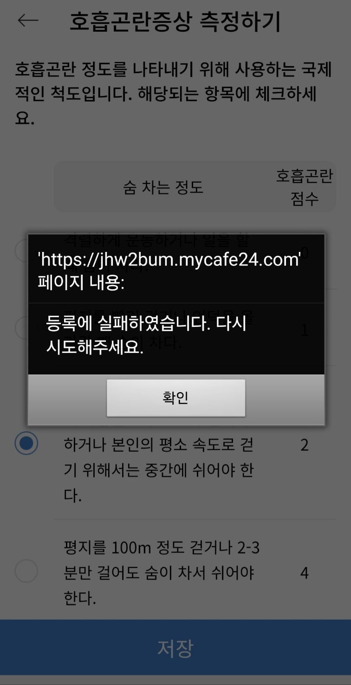
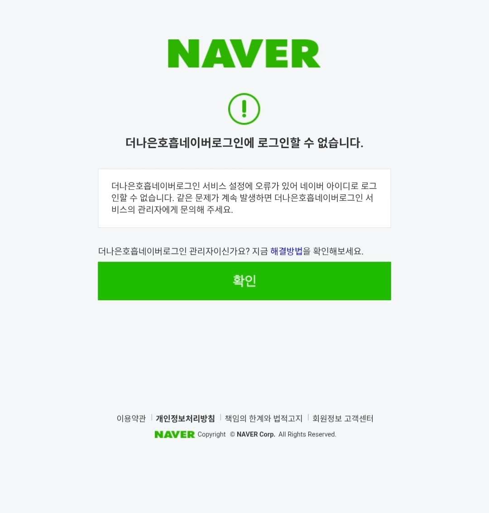
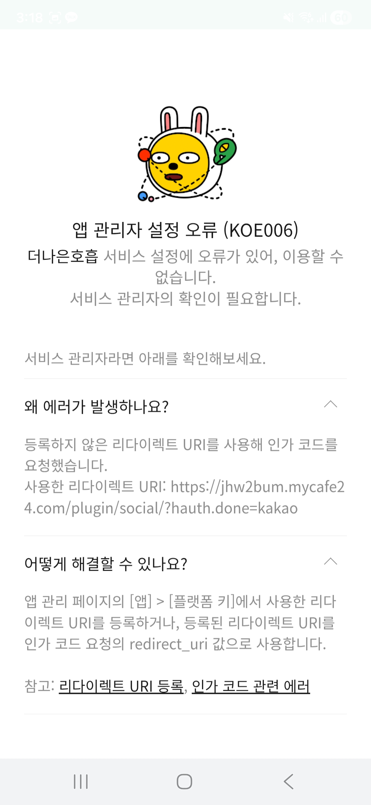
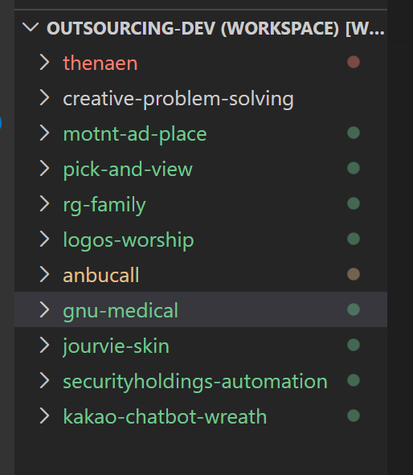

# 피드백
아래와 같이 문의가 왔는데, 분석좀 해줘!

안녕하세요 개발자님
제가 회신이 늦었네요.
이전에 말씀드린 것들 중에서 해결이 된 것도 있고, 새로 발생한 문제도 있습니다. 왜 그런걸까요ㅠㅠ?

문제1.
로그인후 첫 메인화면 글자 깨짐(동일)
문제2.
[호흡곤란증상측정하기] - 저장안되고 에러창뜸 "등록에 실패하였습니다. 다시 시도해주세요"
문제3.
나의 재활일지 - 연동안됨
문제4.
복약시간알림, 운동시간알림 - 설정이안됨
문제5.
네이버, 카카오 로그인 안됨.

원래 네이버 카카오로 로그인했을땐 문제 3,4,5는 됐었는데 왜 로그인자체가 안될까요?

#
감사합니다 ! 혹시 이거 최대 몇명까지 동시에 안정적으로 사용할 수 있는지 여쭤봐도 될까요? 
여러명이 쓰다보면 조금씩 느려지기도 하는 것 같아서요 ! 대화내역은 어떤 방식으로 확인할 수 있는지도 안내해주시면 감사하겠습니다

라고 왔는데 이거에 대해 답해줘!

지금 이 구조인데, 

워크스페이스 내에 여러개 프로젝트가 있고 여기에 추가로 전체 workspace를 넣고 싶단 말이였어. 각 프로젝트 폴더와 별개로 말야... 이해가?